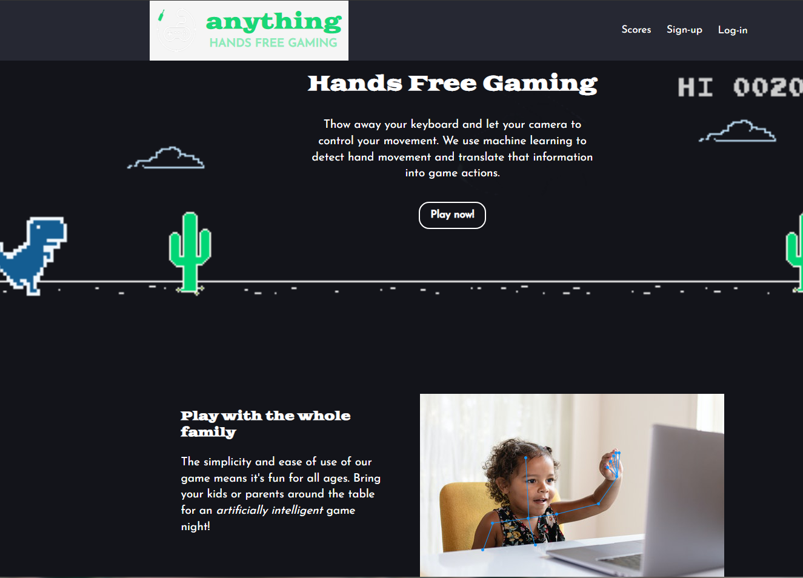
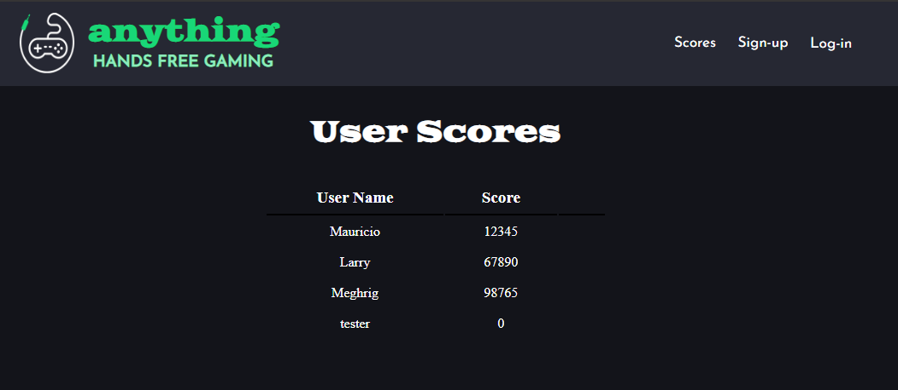
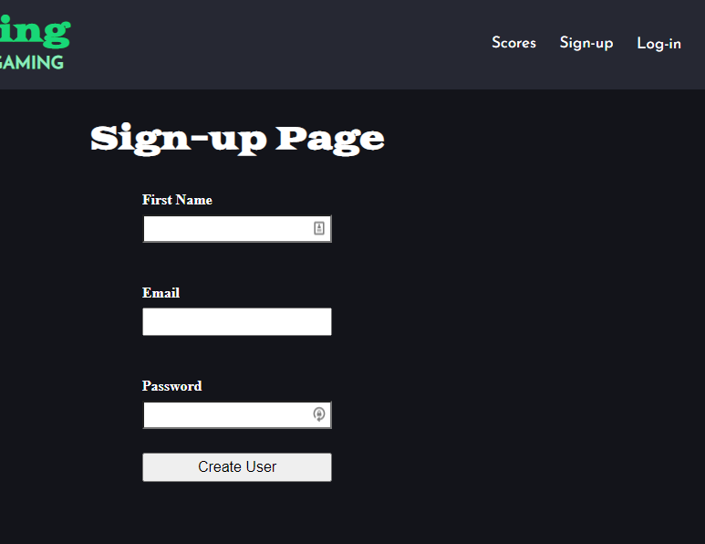

# Practical

Our website hosts a game, validates user sign ups and logins as well as stores user scores.

## Main Page

## Scores

## Sign Up / Login

# Design

This file contains our design ideas as well as our sources of inspiration. 🧠

## Team: Anything

Name: Anything

Slogan: Hands free gaming

Logo: 

Color Palette: 

Font Families:  

Headings: font-family: 'Goblin One', cursive;

Long Text: font-family: 'Josefin Sans', sans-serif;

Inspiration:

[Yamauchi No.10 Family Office (y-n10.com)](https://y-n10.com/)

[Proxy | Home](https://www.proxy.com/)

CSS Battles on YouTube, they use empty DIVs in order to make custom shapes.

https://youtu.be/-QgJgZCJvo4?t=304

